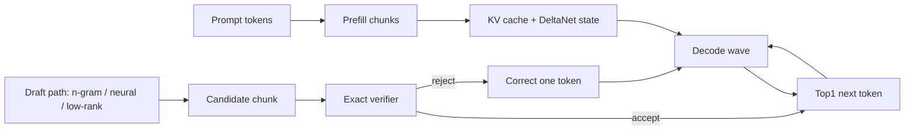

# How We Built a Qwen 3.5/3.6 Inference Engine

30-minute talk, simple level. Audience does not need to know Metal, quantization, or LLM internals deeply.

## Timing Plan

- 0-3 min: Why build our own engine?
- 3-8 min: What inference actually does.
- 8-15 min: Architecture and correctness.
- 15-23 min: Performance work: prefill, decode, speculation.
- 23-28 min: Lessons learned.
- 28-30 min: What is next + Q&A.

## Slide 1 — Title

**How We Built a Qwen 3.5/3.6 Inference Engine**

- Native Crystal + Metal runtime
- Qwen 3.5/3.6 GGUF models
- Goal: understand, control, and optimize inference
- Comparison target: llama.cpp

Speaker clues:
- Start with the honest framing: this was not “let’s wrap an existing library”.
- We wanted an engine where every bottleneck is visible and changeable.
- Mention that the work became a research/engineering loop: implement, measure, refute, keep only what survives.

## Slide 2 — The Simple Mental Model

**LLM inference is repeated matrix math plus state updates**

- Input text becomes tokens.
- Tokens become vectors.
- Each layer transforms vectors and updates caches/state.
- The final vector predicts the next token.
- Repeat until enough tokens are generated.

Speaker clues:
- Use a factory analogy: each token moves through 32 stations/layers.
- Each station reads weights, does math, and updates memory.
- The expensive part is often not “thinking”; it is reading gigabytes of weights/state efficiently.

## Slide 3 — Why Qwen 3.5/3.6 Was Not Just Another Transformer

**Qwen 3.5/3.6 is hybrid**

- Some layers are normal attention layers.
- Many layers are recurrent DeltaNet-style layers.
- It has large FFN blocks: gate/up/down projections.
- It uses quantized GGUF weights: Q4_K, Q5_K, Q6_K, Q8_0.
- It has prompt prefill and token-by-token decode paths.

Speaker clues:
- Keep this simple: “attention remembers previous tokens with KV cache; recurrent layers remember with a compact state”.
- The challenge is that both memory systems must be correct and fast.
- Mention that 3.6/27B scales the same ideas but makes bandwidth and state even more important.

## Slide 4 — Our Engine Shape

**Three layers of implementation**

```text
CLI / probes / benchmark harnesses
          |
Crystal CPU/reference + scheduler
          |
Metal kernels: matmul, attention, DeltaNet, top1, state copy
```

- CPU path is the truth oracle and debugging aid.
- Metal path is the fast path.
- Bench/probe programs are first-class tools, not afterthoughts.

Speaker clues:
- Explain why CPU/reference exists: not for speed, for trust.
- If GPU gives a different token, we need to know whether it is a kernel bug, rounding issue, or expected approximation.
- Probes saved time because they let us test one idea without rewriting the whole engine.

## Slide 5 — Challenge 1: Correctness Before Speed

**If one token changes, the whole continuation can diverge**

- Layer-by-layer comparisons against reference.
- Cosine/logit/top1 checks.
- Greedy parity checks: generated token IDs must match exact path.
- Fail-closed speculative verification.
- Approximate paths stay opt-in until proven safe.

Speaker clues:
- Use the “fork in the road” analogy: one wrong token changes the entire future.
- This is why “looks close” is not enough.
- Mention near-tie logits: sometimes top1 and top2 differ by tiny margins, so approximate shortcuts can flip a token.

## Slide 6 — Challenge 2: Prefill Is Different From Decode

**Prefill and decode optimize different shapes**

- Prefill: many prompt tokens at once.
- Decode: one new token at a time.
- Prefill likes batch GEMM and chunking.
- Decode likes low-latency GEMV and fewer synchronizations.
- A kernel that wins in microbench can lose in full prefill.

Speaker clues:
- “Reading a whole paragraph” vs “writing one word at a time”.
- The best algorithm for one is often wrong for the other.
- Good example: some standalone Q4 kernel experiments improved a microbench but regressed pp64 wall time.

## Slide 7 — Prefill: What Actually Worked

**We moved work from token-by-token to GPU-resident chunks**

- Chunked recurrent prefill on Metal.
- Q4/Q5/Q6 batch GEMM for prompt tokens.
- Fused or reduced unnecessary final-token work.
- Kept consecutive recurrent layers GPU-resident.
- Added attribution: which tensors/shapes dominate time.

Useful numbers from the ledger:
- Early pp64 prefill improved from about `52.87 tok/s` to `358.44 tok/s` through chunking and batching steps.
- Prepared-state pp64 reached about `449.73 tok/s` in one measured checkpoint.
- Hot traffic: recurrent FFN gate/up Q4_K, recurrent Q5 projection, FFN-down.

Speaker clues:
- Do not overload the audience with every number.
- The story: “batch the prompt, keep it on GPU, avoid unnecessary reads/writes, measure the hot shapes”.
- Emphasize that attribution mattered more than guessing.

## Slide 8 — Decode: What Actually Worked

**Decode is about hiding overhead and doing less work per token**

- Wave scheduling groups layer work into fewer command buffers.
- Fused top1 avoids reading full logits when only greedy token is needed.
- FFN-down residual-add fusion removed separate add kernels.
- State preparation avoids first-touch allocation in latency-sensitive paths.
- Exact n-gram speculative decode accelerates repeat-heavy prompts.

Useful numbers from the ledger:
- Guarded local baseline showed native decode around `+4-5%` faster than llama.cpp on pp64/gen64 snapshots.
- Some repeat-heavy n-gram paths reached roughly `~9-14 ms/tok`, depending on prompt and policy.

Speaker clues:
- “Decode is death by a thousand tiny waits.”
- A few microseconds per layer add up over 32 layers and many tokens.
- Exact n-gram is easy to explain: if the prompt already contains a repeated phrase, propose the continuation, then verify it exactly.

## Slide 9 — Speculative Decoding Without Losing Exactness

**Draft fast, verify exactly**

```text
Draft proposes:  token A, B, C, D
Exact target verifies the chunk
If all match: accept many tokens at once
If mismatch: accept prefix, correct one token, continue
```

- Tried external Qwen 0.8B draft.
- Built self-draft / low-rank / PCA-style experiments.
- Added adaptive gamma: longer chunks only after recent success.
- Added target-only fallback when speculation is not paying.
- Kept exact output parity as the rule.

Speaker clues:
- This is the easiest “wow” idea but also the easiest to get wrong.
- The draft does not need to be correct always; it needs to be cheap and often accepted.
- If rejection is likely, speculation can be slower than plain decode.

## Slide 10 — Mathematical Shortcuts We Explored

**The main question: can we do less exact work but still verify output?**

- Projected-K / low-rank DeltaNet state.
- PCA-updown / block surrogate ideas for FFN/body approximation.
- DeltaNet associative/block-scan research for long prefill.
- MTP experiments: multi-token heads are useful only if the economics work.
- Raw-Q8 CUDA/DP4A as proposal-only unless exact parity holds.

Speaker clues:
- Keep the promise modest: these are research routes, not all product defaults.
- Explain the difference between exact acceleration and proposal acceleration.
- Exact verifier is the safety net: approximate draft may be allowed; exact target decides the final output.

## Slide 11 — How We Made Decisions

**The workflow was as important as the kernels**

- Landmark log: save facts, wins, and refutations.
- Paired A/B benchmarks instead of one-off timings.
- Compare against llama.cpp on the same model/prompt when possible.
- Record refuted ideas so we do not loop.
- Optimize only after attribution points to the wall.

Speaker clues:
- Mention the “Quadrumvirate” lightly if audience knows it; otherwise call it “structured skepticism”.
- Cassandra: what can fail?
- Daedalus: are we solving the wrong problem?
- Maieutic: what assumption are we taking for granted?
- Adversary: can this break on edge cases?

## Slide 12 — Examples Of Refutations

**A failed experiment is a useful result if it is recorded**

- Faster standalone Q4 kernels sometimes regressed full prefill.
- Some fusions saved dispatches but increased register pressure.
- CPU draft was slower due synchronization and body cost.
- Full-row verifier was fast but could flip close logits.
- GPU/session n-gram lookup was not the wall yet.

Speaker clues:
- This slide is important: it shows engineering discipline.
- “We did not win by believing every clever idea. We won by killing bad ideas quickly.”
- Use one example: full-row top1 looked fast but failed exactness on close logits, so it stayed guarded/default-off.

## Slide 13 — Where We Stand Versus llama.cpp / vLLM / MLX

**Current status is mixed, not a universal victory claim**

- llama.cpp is still an excellent baseline.
- Native decode has matched or beaten llama.cpp in local snapshots.
- First-run prefill remains close and depends on state/preallocation timing.
- Prompt-cache restore and n-gram/speculative paths can be much faster on the right workload.
- vLLM/MLX teach different lessons: serving scheduler, GPU-side rejection, graph/lazy fusion.

Speaker clues:
- Be explicit: “We do not claim we beat everyone everywhere.”
- The useful claim: we now understand where the time goes and have paths that win on specific workloads.
- For production, workload shape matters: short chat, long prompt, repeated prompt, coding, batch serving.

## Slide 14 — What I Would Do Next

**Next frontier: turn observability into another speed step**

- Quiet paired operator timing against llama.cpp Metal.
- Focus first on Q4_K `4096x12288 b64` and Q5/Q6 recurrent projections.
- Continue exact n-gram/router policy work for repeat/fact prompts.
- Keep approximate raw-Q8/low-rank routes proposal-only until verified by exact target.
- CUDA path: learn from llama.cpp MMVQ / vLLM scheduler, but preserve exactness gates.

Speaker clues:
- This is a good closing slide: “we know the next experiments”.
- Avoid overpromising. Say the next win likely comes from aligned operator timing + kernel economics, not random retuning.

## Slide 15 — Takeaways

**Five simple lessons**

1. Correctness gates first; speed second.
2. Prefill and decode are different products.
3. The bottleneck is usually data movement, not arithmetic alone.
4. Speculation only helps when proposal cost + rejection cost is lower than plain decode.
5. Logs of refuted ideas are an engineering asset.

Speaker clues:
- End with the engineering/process message, not just kernels.
- One sentence close: “The engine became fast because we made it observable, falsifiable, and exact by default.”

## Optional Whiteboard Diagram



## If You Need To Shorten To 20 Minutes

Keep slides:
- 1 title
- 2 mental model
- 3 hybrid Qwen
- 4 engine shape
- 5 correctness
- 7 prefill wins
- 8 decode wins
- 9 speculative decoding
- 11 decision workflow
- 13 status vs llama.cpp
- 15 takeaways

Skip or compress:
- mathematical shortcuts
- refutation examples
- next frontier

## Likely Questions And Short Answers

**Q: Why not just use llama.cpp?**

A: llama.cpp is the baseline and a strong reference. Building our own engine gives us full control over scheduling, speculative routes, prompt-cache restore, and research experiments such as low-rank DeltaNet or exact n-gram verification.

**Q: Is it exact?**

A: The default target path is exact against our correctness gates. Approximate routes are kept opt-in or proposal-only unless exact verification accepts the produced tokens.

**Q: What was the hardest part?**

A: Not one kernel. The hardest part was separating real speedups from measurement noise and from microbench wins that regress the full workload.

**Q: What matters more: Metal kernels or algorithms?**

A: Both. Kernels give local wins. Bigger wins usually come from changing the work shape: chunking prefill, avoiding full logits, prompt-cache restore, exact speculative chunks, or doing less proposal work.

**Q: Did we beat llama.cpp?**

A: On some local decode snapshots and some workload-specific routes, yes. On first-run prefill, it is close/mixed and still under investigation. The honest message is not universal victory; it is that we now have instrumentation and specific paths to attack the remaining gap.

**Q: What is the most reusable lesson?**

A: Build attribution early. If you cannot name the hot tensor shape and the exact timed region, you are probably optimizing the wrong thing.

---

# Presenter Deep Notes

These notes are intentionally more detailed than the slides. Use them to answer questions and to choose examples live.

## The Core Narrative In One Minute

We built a native inference engine for Qwen 3.5/3.6 because wrapping an existing runtime would not give us enough control over scheduling, state, speculative decoding, and research branches. The engine has a Crystal reference/control layer and Metal kernels for the hot math. The work was not a straight line: most clever ideas were measured and many were rejected. The biggest wins came from changing the shape of the work: batch prompt tokens, keep state on GPU, avoid unnecessary logits, verify speculative chunks exactly, and use attribution before tuning kernels.

If you need one clean sentence:

> We made Qwen inference faster by turning a black-box generation loop into an observable pipeline where every token, state buffer, kernel, and rejected optimization could be measured.

## Explaining “Inference Engine” Simply

An inference engine is the runtime that turns model weights plus input text into output text. It is not training. It does not change the model weights. It has to:

- load quantized model weights;
- tokenize text;
- maintain caches/state across tokens;
- run layer math on GPU;
- choose the next token;
- repeat with low latency;
- stay numerically close enough that greedy output remains exact when we claim exactness.

Analogy:

- The model is a giant recipe book.
- Inference is the kitchen line repeatedly cooking one next-word prediction.
- Prefill is preparing all ingredients from the prompt.
- Decode is plating one new word at a time.
- Optimization is mostly about not walking across the kitchen for every ingredient.

## Why Qwen 3.5/3.6 Is Interesting

Simple transformer engines mostly focus on attention + FFN. Qwen 3.5/3.6 has a hybrid layout:

- Full-attention layers: use KV cache and attention over previous tokens.
- Recurrent/DeltaNet layers: maintain recurrent state, closer to “state machine” behavior.
- FFN blocks: large gate/up/down projections, often the dominant weight traffic.
- Quantized weights: Q4_K, Q5_K, Q6_K, Q8_0 have different kernel economics.

Important phrasing:

- Avoid saying “Mamba” casually unless you clarify that the actual local target was DeltaNet-style recurrent layers, not plain Mamba.
- Say “hybrid model” rather than “just a transformer”.

## Correctness Details You Can Mention

Correctness was not only “does it compile?” We used several levels:

- CPU/reference primitives for individual operations.
- Layer-level comparisons against expected outputs.
- Cosine and max-delta checks for vectors/logits.
- Top1 equality for greedy token selection.
- Full greedy parity for generated token IDs.
- Regression specs around known hazards, such as shared Metal constants after loading target + draft models.

Why exactness is hard:

- Quantized matmuls round values.
- F16 and F32 paths can differ slightly.
- If top1 and top2 logits are close, tiny numeric differences can flip the selected token.
- One flipped token changes all following tokens.

Good live example:

- “We had fast full-row verifier routes that looked attractive, but close-logit rows could flip top1. Those routes stayed guarded/default-off instead of being promoted.”

## Prefill Details

Prefill means ingesting the existing prompt before generating new tokens. A prompt of 64 tokens means the engine should process 64 known tokens and leave caches/state ready for token 65.

What made prefill faster:

- Stop treating the prompt like 64 independent decode steps.
- Batch prompt tokens into GEMM-style kernels.
- Keep recurrent chunks GPU-resident.
- Avoid unnecessary final-output work for non-final prompt tokens.
- Use memory-aware chunk sizes for long prompts.
- Attribute exact hot shapes instead of guessing.

Useful sequence from the ledger:

- Early pp64 prefill: about `52.87 tok/s`.
- GPU-resident recurrent chunks: improved step by step.
- Full-attention chunking: one major jump.
- Q5/Q6 batch GEMM: another major jump.
- Final-token top1 shortcut: another major jump.
- Prepared-state pp64 checkpoint: around `449.73 tok/s`.

How to explain numbers:

- Do not present them as universal benchmarks.
- Say “on our M2 Max Q4_K_M local checkpoints”.
- Emphasize the direction and method rather than one exact number.

## Decode Details

Decode is one-token-at-a-time generation. It is latency-sensitive. With batch=1, some batch-matrix tricks do not help.

What helped:

- Wave scheduling: grouping layer work to reduce host/GPU synchronization.
- Greedy top1 kernels: if we only need the best token, avoid reading a full logits vector.
- State preparation: allocate/clear GPU state before latency-sensitive timing.
- Small exact fusions: for example FFN-down + residual add.
- Speculative routes: accept multiple tokens when a cheap proposal is correct.

What often did not help:

- Saving one dispatch while increasing register pressure.
- Copying llama.cpp kernel parameters blindly.
- CPU-side draft models, because synchronization and CPU compute cost dominated.

## Speculative Decoding Details

Speculative decoding is a two-part system:

1. A draft path proposes several tokens quickly.
2. The exact target model verifies those tokens.

If the draft is right, we accept several tokens for the cost of one verifier chunk. If wrong, we accept only the matching prefix and correct one token.

Terms:

- `gamma`: how many tokens the draft proposes in one chunk.
- acceptance rate: how many proposed tokens survive exact verification.
- target-only fallback: stop speculating when it is clearly wasting time.
- n-gram draft: use repetitions already present in history as candidate future text.
- neural draft: use a smaller model or self-draft route.

Important insight:

- Speculation can be slower than plain decode if proposals are expensive or often rejected.
- The policy/router matters as much as the draft kernel.

## N-Gram Speculation Details

N-gram speculation is simple and exact-verified:

- Look for a suffix in current history that appeared before.
- Propose the tokens that followed that previous occurrence.
- Verify the proposed chunk with the target model.
- Disable or fall back if rejection happens.

Why it is useful:

- Very cheap proposal source.
- Strong on repeated/factual/template-like prompts.
- Fail-closed behavior can keep it near target-only when no good repeat exists.

Why it is not universally good:

- Some repeated patterns are misleading.
- Short chunks can have poor economics.
- Router features are needed: candidate length, match length, lag signals, token-class features, prompt hints.

Good line:

> N-gram is not intelligence; it is cheap exact-verified reuse of history.

## Low-Rank / PCA / Surrogate Details

These branches try to make the proposal body cheaper, not necessarily replace the exact model.

Ideas explored:

- Low-rank DeltaNet: represent recurrent state with smaller projected basis.
- PCA-updown: approximate parts of FFN behavior in compressed subspace.
- Block residual surrogate: approximate a band of layers as a cheaper residual map.
- MTP: use multi-token prediction heads where available, but verify economics.
- Raw-Q8 CUDA/DP4A: faster approximate FFN proposal body; not exact target by default.

Key distinction:

- Exact route: must preserve output directly.
- Proposal route: may be approximate if exact verifier checks final tokens.

This avoids overclaiming: we can say these are promising research/proposal branches, not all product defaults.

## Benchmarking Details

Why benchmarking was hard:

- Desktop host load changes timings.
- Apple unified memory means CPU/GPU effects differ from CUDA discrete memory.
- First-run state allocation can contaminate prefill timing.
- Microbenchmarks can improve while full workload regresses.
- llama.cpp, MLX, vLLM measure different serving shapes.

What we added:

- load warnings and quiet-mode checks;
- prepared/preallocated state benchmark modes;
- lifecycle breakdown: `State.new`, `prepare_state_metal!`, actual prefill;
- wait-only op attribution to compare better with llama.cpp backend op timings;
- paired interleaved A/B to reduce drift.

Good line:

> The benchmark harness became part of the product. Without it, we were optimizing anecdotes.

## How To Explain LTP/WBA Without Jargon

If you want to mention LTP/WBA, describe it operationally:

- Keep related work together.
- Avoid blocking between pieces that can be staged as a wave.
- Move synchronization boundaries to places where they actually create value.
- Fuse or batch across the right boundary, not just the nearest two kernels.

Simple version:

> Instead of making every small operation faster in isolation, we asked where the whole wave of work should start, wait, and commit.

Examples:

- Decode wave scheduling.
- Prefill grouped command buffers.
- Speculative verifier chunks.
- Potential future branch ledger / resident proposal-verifier pipeline.

## What To Say About llama.cpp, MLX, vLLM

llama.cpp:

- Strong baseline.
- Excellent quantized kernels and broad model support.
- Useful reference for GGUF layout and architecture details.
- We compare against it, but do not blindly copy it.

MLX:

- Good lesson in graph/lazy execution and Apple-native arrays.
- Reinforces the idea that boundaries and memory placement matter.

vLLM:

- Strong serving-system ideas: batching, KV/page management, speculative scheduling, GPU-side acceptance/rejection.
- More relevant to multi-user server throughput than single local CLI latency.

Honest comparison line:

> We are not universally faster than all of them. We have local wins, workload-specific wins, and a clearer map of what remains.

## Suggested Verbal Transitions

Slide 2 to 3:

- “That is the generic picture. Qwen 3.5/3.6 adds one twist: not every layer remembers context in the same way.”

Slide 5 to 6:

- “Once correctness was guarded, the next question was not ‘what kernel can we write?’ but ‘which phase are we optimizing?’”

Slide 8 to 9:

- “After local decode optimizations, the bigger lever was to stop generating exactly one token per expensive target pass when we can verify several.”

Slide 11 to 12:

- “The most valuable part of the process was not only the wins. It was recording the things that looked smart but failed.”

Slide 13 to 14:

- “So the next work is not random tuning. It is targeted: compare the exact hot shapes and attack the remaining gap with aligned measurements.”

## If Someone Asks For One Technical Deep Dive

Pick one of these depending on audience:

1. Prefill chunking:
   - show how many prompt tokens become one GPU batch;
   - explain why batch GEMM beats repeated GEMV;
   - mention recurrent state makes it harder than ordinary transformer prefill.

2. Speculative decoding:
   - draw draft/verify/accept/reject loop;
   - explain exact verification keeps final output safe;
   - explain why bad draft economics can lose.

3. Benchmarking/refutations:
   - show why a microbench win can regress the full workload;
   - explain paired A/B and quiet-mode checks;
   - this is the best non-specialist engineering lesson.

## Phrases To Avoid

- Avoid: “We solved Qwen inference.”
- Better: “We built a working native engine and optimized several hot paths.”

- Avoid: “Speculation makes it 2x faster.”
- Better: “Speculation can be much faster when proposal cost and acceptance rate line up.”

- Avoid: “Approximation is safe.”
- Better: “Approximate routes are proposal-only unless exact verification accepts the tokens.”

- Avoid: “We beat llama.cpp.”
- Better: “We have local decode/workload-specific wins; first-run prefill remains close and measurement-sensitive.”
